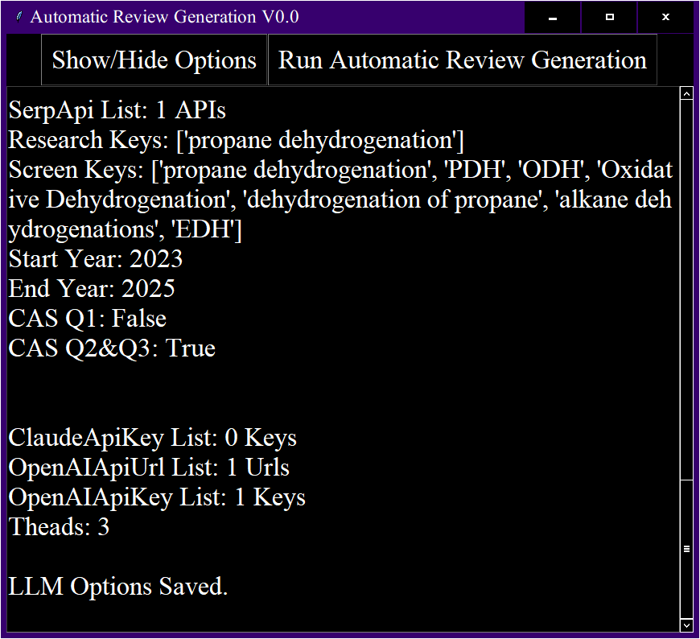

<h1 align="center">
Graphical User Interface Tutorial
</h1>


Translated from Chinese tutorials by GPT-4, refer to the [Chinese tutorials](GUI使用教程.md) for accuracy.


# 1. Prepare API Keys (This tutorial is from GPT-4)
>
>  First, contact the author to obtain a GUI running license.
> 
> Preparing API keys is a prerequisite for using various API services. This guide covers how to obtain API keys for SerpAPI, LLM, and Elsevier.
> 
> #### SerpAPI Key
> 
> 1. **Register or Login**
>    - Visit the [SerpAPI](https://serpapi.com/) website, register an account or login if you already have one.
> 2. **Access Dashboard**
>    - After logging in, navigate to your user dashboard.
> 3. **Find or Generate API Key**
>    - On the dashboard, you should be able to see your API key. If not, there might be an option to generate a new key.
> 4. **Copy API Key**
>    - Copy the API key for use in your application.
> 
> #### LLM Key (Supports Claude2 API and OpenAI format API)
> 
> 1. **Register or Login**
>    - Identify the LLM (Large Language Model) API provider (such as OpenAI), create an account or login.
> 2. **Acquire API Access**
>    - Go to the website's API or developer section.
> 3. **Generate API Key**
>    - Look for an option to generate a new API key and follow the prompts to create one.
> 4. **Copy and Secure Key**
>    - Copy the generated API key and store it securely, as it allows access to LLM services.
> 
> #### Elsevier Key
> 
> 1. **Elsevier Account**
>    - Visit [Elsevier's Developer Portal](https://dev.elsevier.com/), register or login.
> 2. **Create New API Key**
>    - Navigate to the section where you can create or manage API keys. This might be in your account settings or a specific "API Keys" section.
> 3. **Application Details**
>    - You might need to provide details about your application, including its name and purpose, to generate an API key.
> 4. **Obtain and Store Key**
>    - After submission, your API key will be displayed. Copy this key and keep it securely stored.
> 
> #### General Tips
> 
> - **Security**: Keep your API keys confidential to prevent unauthorized access.
> - **Regeneration**: If a key is compromised, regenerate it from the service's dashboard as soon as possible.
> - **Usage Limits**: Be aware of any usage limits or quotas associated with your API keys to avoid service interruptions.

# 2. Set Environment Variables (This tutorial is from GPT-4)
> 
> The environment variable to set is: ElsClientKey, which is the Elsevier key obtained in the previous step.
> 
> In Windows 10, you can use command line tools, such as `cmd` or `PowerShell`, to set environment variables. Here is a guide to the two main methods.
> 
> #### Via Command Prompt (CMD)
> 
> 1. **Set Temporary Environment Variable**:
>    - Open Command Prompt (CMD).
>    - Use the `set` command to set an environment variable. This sets a temporary variable that disappears after closing the CMD window. For example, to set an environment variable named `MYVAR` with the value `value`:
>      ```
>      set MYVAR=value
>      ```
> 2. **Set Permanent Environment Variable**:
>    - For a permanent environment variable, you need to use the `setx` command. This permanently adds or modifies an environment variable, but only affects new command line windows. For example:
>      ```
>      setx MYVAR "value"
>      ```
>    - To set an environment variable for all users, use the `/M` switch:
>      ```
>      setx /M MYVAR "value"
>      ```
>    
>    Note that when using `setx`, if the environment variable value contains spaces, it needs to be enclosed in quotes.
> 
> #### Via PowerShell
> 
> 1. **Set Temporary Environment Variable**:
>    - Open PowerShell.
>    - Use `$env:` to set a temporary environment variable, which will be effective in the current PowerShell session. For example:
>      ```
>      $env:MYVAR = "value"
>      ```
> 2. **Set Permanent Environment Variable**:
>    - Use the `[System.Environment]::SetEnvironmentVariable` method. This allows you to set a permanent environment variable for the current user or all users. For example, to set for the current user:
>      ```
>      [System.Environment]::SetEnvironmentVariable("MYVAR", "value", [System.EnvironmentVariableTarget]::User)
>      ```
>    - To set for all users, make sure to run PowerShell as an administrator, then execute:
>      ```
>      [System.Environment]::SetEnvironmentVariable("MYVAR", "value", [System.EnvironmentVariableTarget]::Machine)
>      ```
>    
>    This requires administrative privileges.
> 
> #### Notes
> 
> - When using the `setx` command, the maximum character length limit is 1024 characters.
> - After setting an environment variable, you may need to restart your command line tool or computer for the changes to take effect.
> - When setting environment variables with PowerShell, choose `User` or `Machine` as the target, representing the current user and all users, respectively.

# 3. Download and Run the Pre-packaged exe File (This tutorial is from GPT-4)
> 
> The following steps will guide you on how to download and run an exe file from a specified GitHub page.
> 
> #### Steps
> 
> 1. **Access the GitHub Release Page**
>    - Open a browser and visit the [AutomaticReviewGeneration release page](https://github.com/Invalid-Null/AutomaticReviewGeneration/releases).
> 2. **Select a Version**
>    - Browse through the different release versions and select the one you need to download.
> 3. **Download the exe File**
>    - Find the file ending in `.exe` in the selected version. Click the download link next to the file name to download.
> 4. **Run the exe File**
>    - After downloading, locate the downloaded `.exe` file and double-click to run.
>    - If the system prompts "Unknown publisher," choose "Run" to continue.

# 4. Interface Button Introduction
>  **The interface after opening the program is as follows**
>  [](https://raw.githubusercontent.com/Invalid-Null/AutomaticReviewGeneration/main/doc/0.png)
> 
>  - TOPIC: The topic of the generated review
>  - Demo: Whether to generate a test with a small amount of literature
>  - Whole Process: Whether to proceed with the whole process, or just perform literature retrieval and download
>
> <!-- -->   
>
>  - Skip Literature Search: Whether to skip the literature search module and proceed to subsequent steps
>  - Skip Topic Formulation: Whether to skip the topic generation module and proceed to subsequent steps
>  - Skip Knowledge Extraction: Whether to skip the knowledge extraction module and proceed to subsequent steps
>  - Skip Review Composition: Whether to skip the review generation module and proceed to subsequent steps
>
> <!-- -->   
>
>  - Search Options: Open the literature search options dialog
>  - LLM Options: Open the large language model options dialog
>
> <!-- -->   
>
>  - Show/Hide Options: Whether to fold the configuration options
>  - Run Automatic Review Generation: Start the review generation
> 
> **The interface after folding the configuration options is as follows**
>  [](https://raw.githubusercontent.com/Invalid-Null/AutomaticReviewGeneration/main/doc/1.png)

# 5. Literature Search Options Configuration
>  1. Literature Search Options Configuration Dialog
>  
>  **The interface of the literature search options configuration dialog is as follows**
>  [](https://raw.githubusercontent.com/Invalid-Null/AutomaticReviewGeneration/main/doc/3.png)
> 
>  - Add to Serp API List: Open the Serp API key (list) configuration dialog
>  - Add to Research Keys: Open the retrieval keywords (list) configuration dialog, i.e., using the keywords (list) for literature search
>  - Add to Screen Keys: Open the filtering keywords (list) configuration dialog, i.e., using the keywords (list) for filtering titles and abstracts
>
> <!-- -->   
>
>  - StartYear: The starting year for literature retrieval
>  - EndYear: The ending year for literature retrieval
>  - Q1: Whether to search in the first-tier journals in the 2022 CAS division table for Chemistry/Chemical Engineering
>  - Q2&Q3: Whether to search in the second and third-tier journals in the 2022 CAS division table for Chemistry/Chemical Engineering
>
> <!-- -->   
>
>  - Save: Save the literature search configuration
>
>  2. Serp API Key (List) Configuration Dialog
>  
>  **The interface of the Serp API key (list) configuration dialog is as follows**
>  [](https://raw.githubusercontent.com/Invalid-Null/AutomaticReviewGeneration/main/doc/4.png)
>
>  Enter the Serp API key obtained in the previous steps, one at a time, without quotes, then click `OK`.
>
>  Clicking `OK` directly or clicking `Cancel` will not modify the Serp API key configuration.
>  
>  Enter `!!!~~~!!!` to clear the existing Serp API key configuration, without quotes.
> 
>  The operation of the retrieval keywords (list) configuration dialog and the filtering keywords (list) configuration dialog is completely consistent with the Serp API key (list) configuration dialog.
> 
> 3. Click save to close the literature search options configuration dialog.
>  
>  **The program interface after clicking save is as follows**
>  [](https://raw.githubusercontent.com/Invalid-Null/AutomaticReviewGeneration/main/doc/2.png)
>  
>  Apart from the Serp API key (list), the content of other options will be printed on the interface.
>  
>  If the configuration is incorrect, reopen the literature search options configuration dialog for configuration.
>
>  Directly closing the literature search options configuration dialog will not save the literature search configuration options.
 
# 6. Large Language Model Options Configuration
>  1. Large Language Model Options Configuration Dialog
>  
>  **The interface of the large language model options configuration dialog is as follows**
>  [](https://raw.githubusercontent.com/Invalid-Null/AutomaticReviewGeneration/main/doc/6.png)
> 
>  - Add to Claude Api Key List: Open the Claude API key (list) configuration dialog
>  - Add to OpenAI-compatible API Url List: Open the OpenAI format API URL (list) configuration dialog
>  - Add to OpenAI-compatible API Key List: Open the OpenAI format API key (list) configuration dialog
>  - Check LLM Response: Check if the configured large language models are accessible
>
>  2. Close the large language model options configuration dialog.
>
>  **The program interface after clicking save is as follows**
>  [](https://raw.githubusercontent.com/Invalid-Null/AutomaticReviewGeneration/main/doc/5.png)
>
>  The operation of the above configuration dialog is completely consistent with the Serp API key (list) configuration dialog.
>
>  Note that the OpenAI format API URLs and keys need to correspond one-to-one.
>
>  Supports adding multiple types of keys and can access in multiple processes to accelerate.
>
>  The configuration dialog is saved directly after clicking confirm.
>
>  After closing the large language model options configuration dialog, the number of configured large language models will be printed on the interface.
>
>  It is recommended to click `Check LLM Response` after configuration to check if the configured large language models are accessible.
>
>  **An example of a successful test is as follows**
>  [](https://raw.githubusercontent.com/Invalid-Null/AutomaticReviewGeneration/main/doc/5.png)
>
>  **An example of a failed test is as follows**
>  [](https://raw.githubusercontent.com/Invalid-Null/AutomaticReviewGeneration/main/doc/7.png)
> 
>  Check the reason for the failure based on the return result and reconfigure.
>
>  Large language models that fail the test will not be applied in the review generation process.

# 7. Run the Review Generation Process
>  Refer to **4. Interface Button Introduction**, select the modules to run.
>
>  Initially, it is recommended not to skip any process.
>
>  If the previous steps are not completed, there will be error prompts.
>
>  The options will automatically fold during the run.
>
>  Supports breakpoint continuation, if the run is interrupted, rerun to continue.
>
>  - **The prompt for an incomplete literature search process is as follows**
>  - [](https://raw.githubusercontent.com/Invalid-Null/AutomaticReviewGeneration/main/doc/8.png)
>
>  - **The prompt for an incomplete topic generation process is as follows**
>  - [](https://raw.githubusercontent.com/Invalid-Null/AutomaticReviewGeneration/main/doc/9.png)
>
>  - **The prompt for an incomplete knowledge extraction process is as follows**
>  - [](https://raw.githubusercontent.com/Invalid-Null/AutomaticReviewGeneration/main/doc/10.png)
